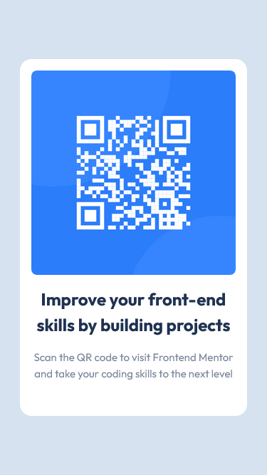

# Frontend Mentor - QR code component solution

This is a solution to the [QR code component challenge on Frontend Mentor](https://www.frontendmentor.io/challenges/qr-code-component-iux_sIO_H). Frontend Mentor challenges help you improve your coding skills by building realistic projects. 

## Table of contents

- [Overview](#overview)
  - [Screenshots](#screenshots)
    - [Desktop solution](#desktop-solution)
    - [Mobile solution](#mobile-solution)
  - [Links](#links)
- [My process](#my-process)
  - [Built with](#built-with)
  - [What I learned](#what-i-learned)
  - [Continued development](#continued-development)
  - [Useful resources](#useful-resources)
- [Author](#author)
## Overview
### Screenshots
#### Desktop solution

#### Mobile solution


### Links

- Live Site URL: [https://almanzarsaul.github.io/qr-code-component-main/](https://almanzarsaul.github.io/qr-code-component-main/)

## My process

I learned a lot from [Kevin Powell's fantastic videos](https://www.youtube.com/@KevinPowell), especially [his recent video on Frontend Mentor](https://youtu.be/B2WL6KkqhLQ). My process was to a mobile-first design, which for this design was especially useful since there was no difference with the desktop layout. Using [Josh W. Comeau's CSS Reset](https://www.joshwcomeau.com/css/custom-css-reset/), I made a clean slate for my project which enabled me to more easily stylize the web page through CSS. After finishing the design for a mobile display, I set the max-width of the card to the approriate size and the desktop view was complete.

### Built with

- CSS custom properties
- CSS Grid
- Mobile-first workflow

### What I learned
- How to easily center an element in CSS. 😂
- Using ```display: grid``` and ```gap: ...``` to space items instead of just giving margin to each individual item in a situation like this.

### Continued development
In the future I would like to hone in on proper semantic HTML with a focus on accessibility and BEM CSS conventions. 
### Useful resources

- [Kevin Powell's YouTube Channel](https://www.youtube.com/@KevinPowell) - This helped me for XYZ reason. I really liked this pattern and will use it going forward.
- [Example resource 2](https://www.example.com) - This is an amazing article which helped me finally understand XYZ. I'd recommend it to anyone still learning this concept.

## Author

- GitHub - [Saul Almanzar](https://github.com/almanzarsaul)
- Frontend Mentor - [@almanzarsaul](https://www.frontendmentor.io/profile/almanzarsaul)


